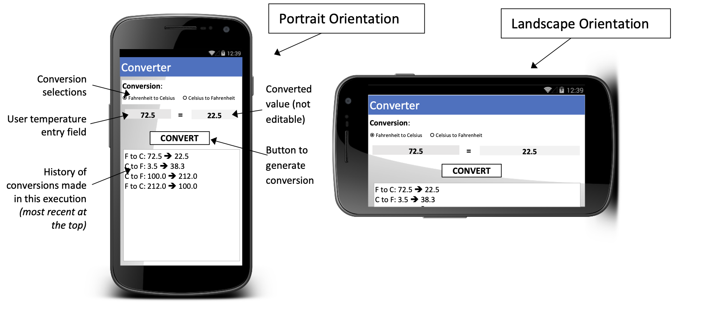
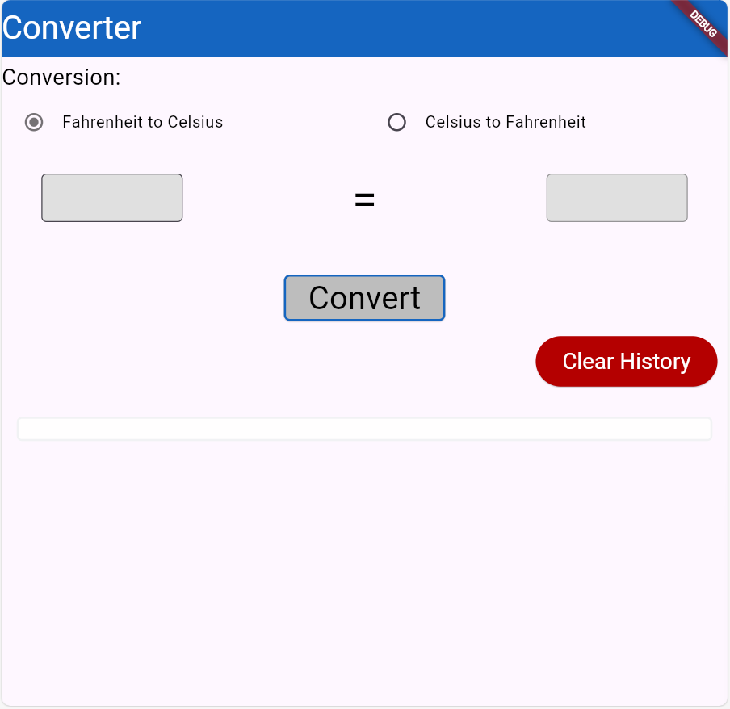

# temperature_conversion_app

# Temperature Conversion App Documentation

## Overview
The **TemperatureConversionApp** is a Flutter application that allows users to convert temperatures between Fahrenheit and Celsius. It provides an interactive UI with radio buttons for selecting the conversion type, text fields for input and output, and a history feature to keep track of previous conversions.

## File Structure
- **`main.dart`**: The entry point of the application.
- **`conversion_app.dart`**: Contains the main functionality and UI elements for temperature conversion.
- **`conversion_visuals.dart`**: Provides a utility class for creating custom text styles.

## Class Structure

### TemperatureConversionApp
- This is the main widget, extending `StatefulWidget`. 
- It manages the state for user input, selected conversion type, calculation history, and any error messages.

### _TemperatureConversionAppState
- This is the state class for the `TemperatureConversionApp`, where the majority of the logic and UI elements reside.

## Key Properties
- **_calculationHistory**: A list that stores the history of conversion results as Widget items, allowing for a visual record of previous calculations.
- **_selectedOption**: A string that keeps track of the currently selected conversion option (either "fahrenheit" or "celsius").
- **_temperatureValue**: A string representing the temperature input by the user.
- **_typeError**: A string that holds error messages related to user input validation.
- **_convertedController**: A `TextEditingController` that manages the output text field for displaying the converted temperature.

## Main Methods
### _onSubmit
- This method processes the input when the user clicks the "Convert" button.
- **Input Validation**: Checks if the input is empty or not a valid number (both integer and double).
- **Conversion Trigger**: Calls `_calculateTemperature` with the parsed value if the input is valid.

### _calculateTemperature
- This method performs the actual conversion based on the selected option.
- **Conversion from Fahrenheit to Celsius**: Uses the formula \((5/9) * (Fahrenheit - 32)\).
- **Conversion from Celsius to Fahrenheit**: Uses the formula \(((9/5) * Celsius) + 32\).
- Updates the calculation history by adding the result as a Row widget.

### _clearHistory
- This method clears the calculation history when the "Clear History" button is pressed.

## UI Structure
- **Scaffold**: The main layout for the app, containing an AppBar, a body with input fields, and buttons.
- **AppBar**: Displays the title of the app.
- **ListView**: Used to allow scrolling of content when there are many elements (like the history).
- **Form**: Contains the input fields and radio buttons for temperature conversion.
- **Column**: Aligns widgets vertically, such as buttons and text fields.
- **Row**: Aligns widgets horizontally, such as the input field, result display, and history records.
- **SizedBox**: Adds spacing between elements and defines the size of input fields, buttons, etc.
- **Expanded**: Allows a child widget to expand and fill the available space within a Row or Column, ensuring that elements are properly sized and aligned.
- **Container**: Wraps UI elements with styling, margins, padding, and borders.
- **RadioListTile**: Provides options for the user to choose the type of conversion.
- **TextFormField**: Used for inputting the temperature and displaying the converted value. The input field for the converted value is disabled to prevent user edits.
- **ElevatedButton**: Buttons for submitting the conversion and clearing history.
- **SingleChildScrollView**: This widget allows a single child widget to be scrollable. It is particularly useful in situations where you have a long list of widgets (like the calculation history in your temperature conversion app). By wrapping the column of results in a `SingleChildScrollView`, users can easily scroll through their conversion history without being limited by the screen size, enhancing the overall user experience.

## Error Handling
- Displays error messages if the user input is invalid. This improves user experience by providing clear feedback.

## Potential Improvements
- **Enhanced Error Handling**: Consider using more specific error messages. For example, differentiate between empty input and non-numeric input.
- **Input Formatting**: Add formatting options to allow the user to input numbers in different formats (e.g., negative temperatures).
- **Accessibility**: Implement accessibility features, such as labels for the input fields, to improve usability for all users.
- **State Management**: As the app grows, consider implementing a state management solution (like Provider or Riverpod) to better manage state and improve code organization.
- **Code Modularization**: Break down larger methods into smaller, reusable components to improve readability and maintainability.
- **Testing**: Consider adding unit tests for the conversion logic to ensure accuracy and reliability.
- **Styling Consistency**: Ensure consistent use of styles and spacing throughout the app for a more polished look.

## Conclusion
Your temperature conversion app is a solid foundation for learning Flutter. It effectively incorporates basic concepts such as state management, user input handling, and UI elements. With a few improvements and enhancements, it can become an even more robust application. Keep up the great work, and feel free to ask if you need help implementing any of these suggestions!
